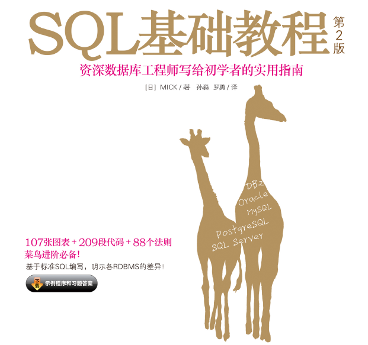

# Programming-SQL（SQL编程）

> `SQL编程`：学习任务包括初始数据库、基础查询和排序语句、复杂查询语句、集合运算、SQL高级处理以及综合练习！

## Task 01 初始数据库
- 1.1 为什么需要数据库？
- 1.2 什么是数据库？
- 1.3 数据库中的结构
- 1.4 `SQL`概要
- 1.5 表的创建
- 1.6 表的删除和更新
- 1.7 学习理解

## Task 02：基础查询与排序
- 2.1 `SELECT`语句基础
- 2.2 算术运算符和比较运算符
- 2.3 逻辑运算符
- 2.4 对表进行聚合查询
- 2.5 对表进行分组
- 2.6 为聚合结果指定条件
- 2.7 对查询结果进行排序
- 2.8 数据的插入（`INSERT`语句的使用方法）
- 2.9 数据的删除（`DELETE`语句的使用方法）
- 2.10 数据的更新（`UPDATE`语句的使用方法）
- 2.11 事务
- 2.12 学习理解

## Task 03：复杂查询
- 3.1 视图
- 3.2 子查询
- 3.3 关联子查询
- 3.4 函数
- 3.5 谓词
- 3.6 `CASE`表达式
- 3.7 学习理解

## Task 04：集合运算
- 4.1 表的加减法
- 4.2 联结（以列为单位进行联结）
- 4.3 学习理解

## Task 05：SQL高级处理
- 5.1 窗口函数
- 5.2 `GROUPING`运算符
- 5.3 学习理解

## Task 06：综合练习

> **参考书籍：**

- [SQL基础教程（第二版）](https://github.com/Hirotransfer/Programming-SQL/blob/main/doc/SQL_Basic.pdf)

  
