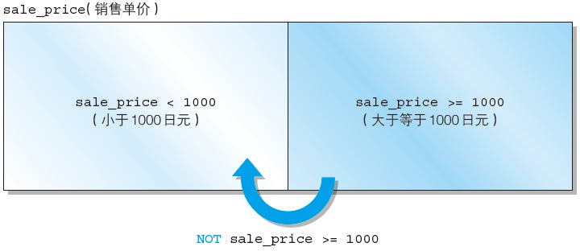
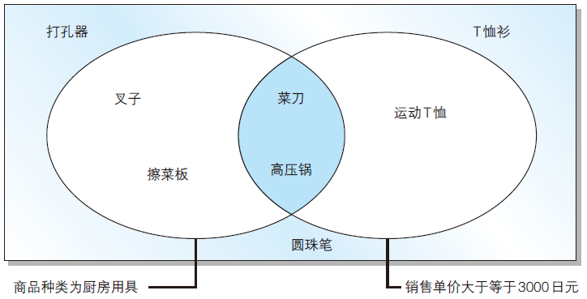
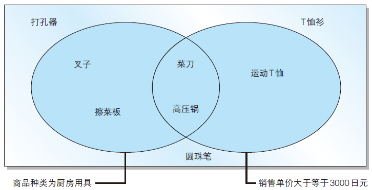
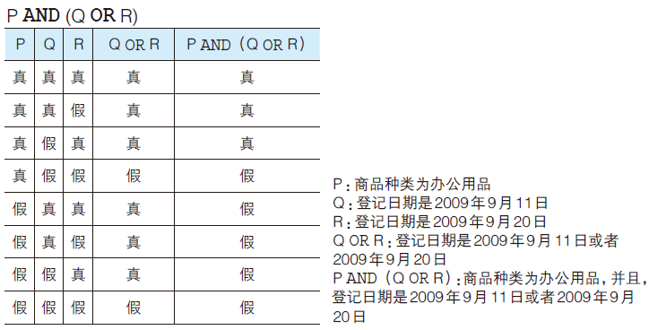
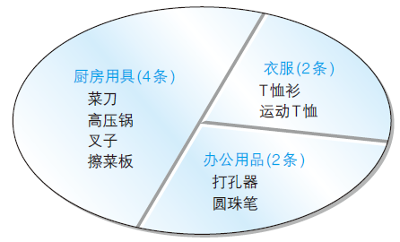
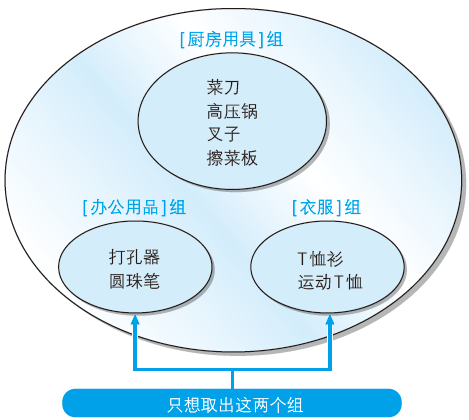

# SQLTask 02：基础查询、排序与更新

**本章重点：**

- `SELECT`语句基础
- 算术运算符和比较运算符
- 逻辑运算符
- 对表进行聚合查询
- 对表进行分组
- 为聚合结果指定条件
- 对查询结果进行排序
- 数据的插入（INSERT语句的使用方法）
- 数据的删除（DELETE语句的使用方法）
- 数据的更新（UPDATE语句的使用方法）
- 事务
- 学习理解

## 2.1 `SELECT`语句基础

- 列的查询

  基本的`SELECT`语句：

  ```sql
  SELECT <column_name>, ...... FROM <table_name>;
  ```

  该`SELECT`语句包含了`SELECT`和`FROM`两个子句（clause） 。`子句`是SQL语句的组成要素，是以SELECT或者FROM等作为起始的短语。SELECT子句中列举了希望从表中查询出的列的名称，而FROM子句则指定了选取出数据的表的名称。

- 查询出表中所有的列

  查询全部的列：

  ```sql
  SELECT * FROM <table_name>;
  ```

- 为列设定别名

  `SQL`语句可以使用`AS`关键字为列设定别名。

  ```sql
  SELECT product_id AS id,
  product_name AS name,
  purchase_price AS price
  FROM Product;
  ```

  别名可以使用中文，使用中文时需要用双引号（"）括起来。

  ```sql
  SELECT product_id AS "商品编号",
  product_name AS "商品名称",
  purchase_price AS "进货单价"
  FROM Product;
  ```

- 常数的查询

  ```sql
  SELECT '商品' AS string, 38 AS number, '2009-02-24' AS date,
  product_id, product_name
  FROM Product;
  ```

- 从结果中删除重复列

  使用`DISTINCT`删除`product_type`列中重复的数据：

  ```sql
  SELECT DISTINCT product_type FROM Product;
  ```

  注意：`DISTINCT`关键字只能用在第一个列名之前！

- 根据`WHERE`语句来选择记录

  `SELECT`语句通过`WHERE`子句来指定查询数据的条件。在`WHERE`子句中可以指定“某一列的值和这个字符串相等”或者“某一列的值大于这个数字”等条件。

  SELECT语句中的WHERE子句：

  ```sql
  SELECT <列名>, …… FROM <表名> WHERE <条件表达式>;
  ```

  从`Product`表中选取商品种类（`product_type`）为'衣服' 的记录。

  SQL中子句的书写顺序是固定的，不能随意更改。WHERE子句必须紧跟在FROM子句之后，书写顺序发生改变的话会造成执行错误。

- 注释的书写方法

  - 单行注释：

    书写在“--”之后，只能写在同一行。

  - 多行注释：

    书写在“/*”和“*/”之间，可以跨多行。


## 2.2 算术运算符和比较运算符

- 算术运算符

  SQL语句中也可以使用运算表达式：

  ```sql
  SELECT product_name, sale_price,
  sale_price * 2 AS "sale_price_x2"
  FROM Product;
  ```

  SQL语句中可以使用的四则运算的主要运算符：

  |   含义   | 运算符 |
  | :------: | :----: |
  | 加法运算 |   +    |
  | 减法运算 |   -    |
  | 乘法运算 |   *    |
  | 除法运算 |   /    |

- 需要注意的`NULL`

  所有包含NULL 的计算，结果肯定是NULL。

- 比较运算符

  选取出sale_price列为500的记录：

  ```sql
  SELECT product_name, product_type
  FROM Product
  WHERE sale_price = 500;
  ```

  选取出sale_price列的值不是500的记录：

  ```sql
  SELECT product_name, product_type
  FROM Product
  WHERE sale_price <> 500;
  ```

  比较运算符：

  | 运算符 |   含义   |
  | :----: | :------: |
  |   =    |   等于   |
  |   <>   |  不等于  |
  |   >=   | 大于等于 |
  |   >    |   大于   |
  |   <=   | 小于等于 |
  |   <    |   小于   |

- 对字符串使用不等号时的注意事项

  创建`Chars`表并插入数据：

  ```sql
  -- DDL ：创建表
  CREATE TABLE Chars
  (
      chr CHAR(3) NOT NULL,
      PRIMARY KEY (chr)
  );
      
  -- DML ：插入数据（MySQL）
  
  START TRANSACTION;
  
  INSERT INTO Chars VALUES ('1');
  INSERT INTO Chars VALUES ('2');
  INSERT INTO Chars VALUES ('3');
  INSERT INTO Chars VALUES ('10');
  INSERT INTO Chars VALUES ('11');
  INSERT INTO Chars VALUES ('222');
  
  COMMIT;
  ```

- 不能对`NULL`使用比较运算符

  `SQL`提供了专门用来判断是否为`NULL`的`IS NULL`运算符。


## 2.3 逻辑运算符

- `NOT`运算符

  `NOT`不能单独使用，必须和其他查询条件组合起来使用。

  选取出销售单价大于等于1000日元的记录：

  ```sql
  SELECT product_name, product_type, sale_price
  FROM Product
  WHERE sale_price >= 1000;
  ```

  在`SELECT`语句的查询条件中添加`NOT`运算符：

  ```sql
  SELECT product_name, product_type, sale_price
  FROM Product
  WHERE NOT sale_price >= 1000;
  ```

  使用NOT运算符时查询条件的变化：

  

- `AND`运算符和`OR`运算符

  在WHERE子句中使用AND运算符或者OR运算符，可以对多个查询条件进行组合。

  AND运算符在其两侧的查询条件都成立时整个查询条件才成立，其意思相当于“并且”。

  OR运算符在其两侧的查询条件有一个成立时整个查询条件都成立，其意思相当于“或者”。

  在WHERE子句的查询条件中使用AND运算符：

  ```sql
  SELECT product_name, purchase_price
  FROM Product
  WHERE product_type = '厨房用具'
  AND sale_price >= 3000;
  ```

  AND运算符的工作效果图：

  

  在WHERE子句的查询条件中使用OR运算符：

  ```sql
  SELECT product_name, purchase_price
  FROM Product
  WHERE product_type = '厨房用具'
  OR sale_price >= 3000;
  ```

  OR运算符的工作效果图：

  

- 使用括号强化处理

  通过使用括号让OR运算符先于AND运算符执行：

  ```sql
  SELECT product_name, product_type, regist_date
  FROM Product
  WHERE product_type = '办公用品'
  AND ( regist_date = '2009-09-11'
  OR regist_date = '2009-09-20');
  ```

  注意：AND运算符的优先级高于OR运算符。想要优先执行OR运算符时可以使用括号。

- 逻辑运算符和真值

  真值表：

  - AND

    |  P   |  Q   | P AND Q |
    | :--: | :--: | :-----: |
    |  T   |  T   |    T    |
    |  T   |  F   |    F    |
    |  F   |  T   |    F    |
    |  F   |  F   |    F    |

  - OR

    |  P   |  Q   | P OR Q |
    | :--: | :--: | :----: |
    |  T   |  T   |   T    |
    |  T   |  F   |   T    |
    |  F   |  T   |   T    |
    |  F   |  F   |   F    |

  - NOT

    |  P   | NOT P |
    | :--: | :---: |
    |  T   |   F   |
    |  F   |   T   |

    查询条件为`P AND（Q OR R）`的真值表：

    

- 含有`NULL`时的真值

  既不是真也不是假，称之为`UNKNOWN`。

  - AND

    |     P     |     Q     |  P AND Q  |
    | :-------: | :-------: | :-------: |
    |     T     |     T     |     T     |
    |     T     |     F     |     F     |
    |     T     | `UNKNOWN` | `UNKNOWN` |
    |     F     |     T     |     F     |
    |     F     |     F     |     F     |
    |     F     | `UNKNOWN` |     F     |
    | `UNKNOWN` |     T     | `UNKNOWN` |
    | `UNKNOWN` |     F     |     F     |
    | `UNKNOWN` | `UNKNOWN` | `UNKNOWN` |

  - OR

    |     P     |     Q     |  P OR Q   |
    | :-------: | :-------: | :-------: |
    |     T     |     T     |     T     |
    |     T     |     F     |     T     |
    |     T     | `UNKNOWN` |     T     |
    |     F     |     T     |     T     |
    |     F     |     F     |     F     |
    |     F     | `UNKNOWN` | `UNKNOWN` |
    | `UNKNOWN` |     T     |     T     |
    | `UNKNOWN` |     F     | `UNKNOWN` |
    | `UNKNOWN` | `UNKNOWN` | `UNKNOWN` |

## 2.4 对表进行聚合查询

- 聚合函数

  通过SQL对数据进行某种操作或计算时需要使用函数。用于汇总的函数称为聚合函数。聚合指的是将多行汇总为一行。

  | 函数  |             含义             |
  | :---: | :--------------------------: |
  | COUNT |   计算表中的记录数（行数）   |
  |  SUM  | 计算表中数值列中数据的合计值 |
  |  SVG  | 计算表中数值列中数据的平均值 |
  |  MAX  | 求出表中任意列中数据的最大值 |
  |  MIN  | 求出表中任意列中数据的最小值 |

- 计算表中数据的行数

  ```sql
  -- 计算全部数据的行数（包含NULL）
  SELECT COUNT(*)
    FROM product;
  ```

- 计算`NULL`之外的数据的行数

  ```sql
  -- 计算NULL以外数据的行数
  SELECT COUNT(purchase_price)
    FROM product;
  ```

  注意：  对于COUNT 函数来说，参数列不同计算的结果也会发生变化。

- 计算合计值

  ```sql
  -- 计算销售单价和进货单价的合计值
  SELECT SUM(sale_price), SUM(purchase_price) 
    FROM product;
  ```

  注意：聚合函数会将NULL排除在外。但COUNT(*)例外，并不会排除NULL。

- 计算平均值

  ```sql
  -- 计算销售单价和进货单价的平均值
  SELECT AVG(sale_price), AVG(purchase_price)
    FROM product;
  ```

- 计算最大值和最小值

  ```sql
  -- MAX和MIN也可用于非数值型数据
  SELECT MAX(regist_date), MIN(regist_date)
    FROM product;
  ```

  注意：是SUM/AVG 函数只能对数值类型的列使用，而MAX/MIN 函数原则上可以适用于任何数据类型的列。

- 使用聚合函数删除重复值（结合关键字`DISTINCT`）

  ```sql
  -- 计算去除重复数据后的数据行数
  SELECT COUNT(DISTINCT product_type)
   FROM product;
  -- 是否使用DISTINCT时的动作差异（SUM函数）
  SELECT SUM(sale_price), SUM(DISTINCT sale_price)
   FROM product;
  ```

  注意：`DISTINCT`写在括号里面和外面的区别！写在括号外面会先计算出数据行数，然后再删除重复数据！

## 2.5 对表进行分组

要点：

（1）聚合键中包含NULL时，在结果中会以“不确定”行（空行）的形式表现出来。

（2）使用聚合函数和GROUP BY子句时需要注意以下4点。

​			a. 只能写在SELECT子句之中；

​			b. GROUP BY子句中不能使用SELECT子句中列的别名；

​			c. GROUP BY子句的聚合结果是无序的；

​			d. WHERE子句中不能使用聚合函数 。

- `GROUP BY`子句

  `GROUP BY`子句结合聚合函数达到先分组再汇总的操作！

  使用格式：

  ```sql
  SELECT <列名1>,<列名2>, <列名3>, ……
    FROM <表名>
   GROUP BY <列名1>, <列名2>, <列名3>, ……;
  ```

  比较有无`GROUP BY`子句的差异：

  ```sql
  -- 按照商品种类统计数据行数
  SELECT product_type, COUNT(*)
    FROM product
   GROUP BY product_type;
   -- 不含GROUP BY
  SELECT product_type, COUNT(*)
    FROM product
  ```

  按照商品种类对表进行切分

  

  形象地描述：`GROUP BY`如同切蛋糕的方式将表进行了分组！

  :notebook_with_decorative_cover: Note: 

  （1）在 `GROUP BY`子句中指定的列称为**聚合键**或者**分组列**。

  （2）子句的书写顺序：1. SELECT → 2. FROM → 3. WHERE → 4. GROUP BY

  注意：GROUP BY 子句的书写位置也有严格要求，一定要写在FROM 语句之后（如果有WHERE 子句的话需要写在WHERE 子句之后）。

- 聚合键中包含`NULL`的情况

  将进货单价（purchase_price）作为聚合键对表进行切分：

  ```sql
  SELECT purchase_price, COUNT(*)
    FROM product
   GROUP BY purchase_price;
  ```

  注意：

  （1）当聚合键中包含NULL 时，也会将NULL 作为一组特定的数据。

  （2）聚合键中包含NULL时，在结果中会以“不确定”行（空行）的形式表现出来。

- 使用`WHERE`子句时`GROUP BY`的执行结果

  使用`WHERE`子句和`GROUP BY`子句进行汇总处理：

  ```sql
  SELECT <列名1>, <列名2>, <列名3>, ……
  FROM <表名>
  WHERE
  GROUP BY <列名1>, <列名2>, <列名3>, ……;
  ```

  使用WHERE子句进行汇总处理时，会先根据WHERE子句指定的条件进行过滤，然后再进行汇总处理。

  ```sql
  SELECT purchase_price, COUNT(*)
    FROM product
   WHERE product_type = '衣服'
   GROUP BY purchase_price;
  ```

  注意区分`SQL`语句的书写顺序：

  `GROUP BY`和`WHERE`并用时`SELECT`语句的执行顺序：FROM → WHERE → GROUP BY → SELECT

- 与聚合函数和`GROUP BY`子句有关的常见错误

  1. 在SELECT子句中书写了多余的列
  2. 在GROUP BY子句中写了列的别名
  3. GROUP BY子句的结果已排序：其实结果是随机的
  4. 在WHERE子句中使用聚合函数：实际上只有SELECT子句和HAVING子句（以及ORDER BY子句）中能够使用聚合函数。

## 2.6 为聚合结果指定条件

要点：

（1）使用COUNT函数等对表中数据进行汇总操作时，为其指定条件的不是WHERE子句，而是HAVING子句。

（2）聚合函数可以在SELECT子句、HAVING子句和ORDER BY子句中使用。

（3）HAVING子句要写在GROUP BY子句之后。

（4）WHERE子句用来指定数据行的条件，HAVING子句用来指定分组的条件。


- `HAVING`子句

  通过GROUP BY子句，可以得到将表分组后的结果。如何通过指定条件来选取特定组的方法呢？？？

  取出符合指定条件的组

  

  HAVING子句的语法格式：

  ```sql
  SELECT <列名1>, <列名2>, <列名3>, ……
  FROM <表名>
  GROUP BY <列名1>, <列名2>, <列名3>, ……
  HAVING <分组结果对应的条件>
  ```

  注意：HAVING 子句必须写在GROUP BY 子句之后！

  比较有无HAVING子句的差异：

  ```sql
  -- HAVING 子句
  SELECT product_type, COUNT(*)
  FROM Product
  GROUP BY product_type
  HAVING COUNT(*) = 2;
  
  SELECT product_type, AVG(sale_price)
  FROM Product
  GROUP BY product_type
  HAVING AVG(sale_price) >= 2500;
  
  -- 不使用HAVING子句
  SELECT product_type, COUNT(*)
  FROM Product
  GROUP BY product_type;
  
  SELECT product_type, AVG(sale_price)
  FROM Product
  GROUP BY product_type;
  ```

  :notebook_with_decorative_cover: Note：使用HAVING 子句时SELECT 语句的顺序：SELECT → FROM → WHERE → GROUP BY → HAVING

- `HAVING`子句的构成要素

  - 常数
  - 聚合函数
  - `GROUP BY`子句中指定的列名（即聚合键）

  HAVING子句用于对分组进行过滤，可以使用数字、聚合函数和GROUP BY中指定的列名（聚合键）。

  ```sql
  -- 数字
  SELECT product_type, COUNT(*)
    FROM product
   GROUP BY product_type
  HAVING COUNT(*) = 2;
  -- 错误形式（因为product_name不包含在GROUP BY聚合键中）
  SELECT product_type, COUNT(*)
    FROM product
   GROUP BY product_type
  HAVING product_name = '圆珠笔';
  ```

- 相对于`HAVING`子句，更适合写在`WHERE`子句中的条件

  - WHERE 子句 = 指定行所对应的条件
  - HAVING 子句 = 指定组所对应的条件

## 2.7 对查询结果进行排序

要点：

（1）在ORDER BY子句中列名的后面使用关键字ASC可以进行升序排序，使用DESC关键字可以进行降序排序。

（2）ORDER BY子句中可以指定多个排序键。

（3）ORDER BY子句中可以使用SELECT子句中定义的列的别名。

（4）ORDER BY子句中可以使用SELECT子句中未出现的列或者聚合函数。

（5）ORDER BY子句中不能使用列的编号。


- `ORDER BY`子句

  使用格式：

  ```sql
  SELECT <列名1>, <列名2>, <列名3>, ……
    FROM <表名>
   ORDER BY <排序基准列1>, <排序基准列2>, ……
  ```

- 指定升序或降序

  默认为升序排列（ASC），降序排列为DESC

  ```SQL
  -- 降序排列
  SELECT product_id, product_name, sale_price, purchase_price
    FROM product
   ORDER BY sale_price DESC;
  ```

- 指定多个排序键

  ```sql
  -- 多个排序键
  SELECT product_id, product_name, sale_price, purchase_price
    FROM product
   ORDER BY sale_price, product_id;
  ```

- `NULL`的顺序

  ```sql
  -- 当用于排序的列名中含有NULL时，NULL会在开头或末尾进行汇总。
  SELECT product_id, product_name, sale_price, purchase_price
    FROM product
   ORDER BY purchase_price;
  ```

- 在排序键中使用别名

  回顾：

  - GROUP BY 子句中不能使用SELECT 子句中定义的别名（Why???）
  - SQL在使用 HAVING 子句时 SELECT 语句的顺序为：FROM → WHERE → GROUP BY → HAVING → **SELECT** → ORDER BY。

- `ORDER BY`子句中可以使用的列

- 不要使用列编号

## 2.8 数据的插入（INSERT语句的使用方法）

- 什么是`INSERT`?

- `INSERT`语句的基本语法

- 列清单的省略

- 插入`NULL`

- 插入默认值

- 从其它表中复制数据

## 2.9 数据的删除（DELETE语句的使用方法）

- `DROP TABLE`语句和`DELETE`语句

- `DELETE`语句的基本语法

- 指定删除对象的`DELETE`语句（搜索型`DELETE`）

## 2.10 数据的更新（UPDATE语句的使用方法）

- `UPDATE`语句的基本语法

- 指定条件的`UPDATE`语句（搜索型`UPDATE`）

- 使用`NULL`进行更新

- 多列更新

## 2.11 事务

- 什么是事务？

- 创建事务

- `ACID`特性

## 2.12 学习理解

1. 编写一条SQL语句，从Product（商品）表中选取出“登记日期（regist_date）在2009 年4 月28 日之后”的商品。查询结果要包含product_name 和regist_date 两列。

   ```sql
   SELECT product_name, regist_date
   FROM Product
   WHERE regist_date >= '2009-04-28';
   ```

2. 分析对Product表执行如下3 条SELECT 语句时的返回结果。

   （1）无法选取出任何一条记录

   ```sql
   SELECT *
   FROM Product
   WHERE purchase_price = NULL;
   ```

   （2）无法选取出任何一条记录

   ```sql
   SELECT *
   FROM Product
   WHERE purchase_price <> NULL;
   ```

   （3）无法选取出任何一条记录

   ```sql
   SELECT *
   FROM Product
   WHERE product_name > NULL;
   ```

3. 请写出两条可以得到对应要求的SELECT 语句。

   要求：能够从Product 表中取出“销售单价（sale_price）比进货单价（purchase_price）高出500日元以上”的商品。

   ```sql
   -- 语句1
   SELECT product_name, sale_price, purchase_price
   FROM Product
   WHERE sale_price >= purchase_price + 500;
   
   -- 语句2
   SELECT product_name, sale_price, purchase_price
   FROM Product
   WHERE sale_price - 500 >= purchase_price;
   ```

   执行结果如下图所示。

   ```sql
   product_name | sale_price | purchase_price 
   -------------+------------+---------------
   T恤衫         | 　 1000    | 500
   运动T恤       |    4000    | 2800
   高压锅        |    6800    | 5000
   ```

4. 请写出一条SELECT语句，从product表中选取出满足“销售单价打九折之后利润高于100日元的办公用品和厨房用具”条件的记录。查询结果要包括product_name列、product_type列以及销售单价打九折之后的利润（别名设定为profit）。

   提示：销售单价打九折，可以通过saleprice列的值乘以0.9获得，利润可以通过该值减去purchase_price列的值获得。

   ```sql
   SELECT product_name, product_type,
   sale_price * 0.9 - purchase_price AS profit
   FROM Product
   WHERE sale_price * 0.9 - purchase_price > 100
   AND ( product_type = '办公用品' OR product_type = '厨房用具');
   ```

