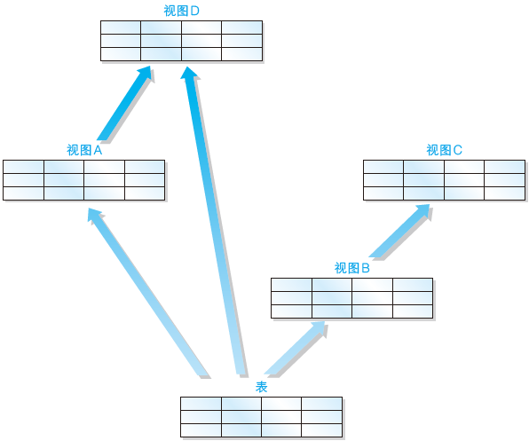

# Task 03：复杂查询

**本章重点：**

- 视图
- 子查询
- 关联子查询
- 函数
- 谓词
- `CASE`表达式
- 学习理解

## 3.1 视图

**学习重点：**

（1）从SQL的角度来看，视图和表是相同的，两者的区别在于表中保存的是实际的数据，而视图中保存的是SELECT语句（视图本身并不存储数据）。

（2）使用视图，可以轻松完成跨多表查询数据等复杂操作。

（3）可以将常用的SELECT语句做成视图来使用。

（4）创建视图需要使用`CREATE VIEW`语句。

（5）视图包含“不能使用ORDER BY”和“可对其进行有限制的更新”两项限制。

（6）删除视图需要使用`DROP VIEW`语句。

- 视图和表

简言之，从SQL 的角度来看视图就是一张表（虚表）。那么视图与表之间到底有何不同呢？区别只有一个：**区别只有一个，那就是“是否保存了实际的数据！**



> Note：一般来说，我们在创建表时，会通过INSERT 语句将数据保存到数据库之中，而数据库中的数据实际上会被保存到计算机的存储设备（通常是硬盘）中。因此，我们通过SELECT 语句查询数据时，实际上就是从存储设备（硬盘）中读取数据，进行各种计算之后，再将结果返回给用户这样一个过程。**但是**使用视图时并不会将数据保存到存储设备之中，而且也不会将数据保存到其他任何地方。实际上**视图保存的是SELECT语句**（上所示）。我们从视图中读取数据时，视图会在内部执行该SELECT 语句并创建出一张**临时表**。

**视图的优点：**

- 由于视图无需保存数据，因此可以节省存储设备的容量。
- 可以将频繁使用的SELECT语句保存成视图。视图中的数据会随着原表的变化自动更新。视图归根到底就是SELECT语句，所谓“参照视图”也就是“执行SELECT 语句”的意思，因此可以保证数据的最新状态。这也是将数据保存在表中所不具备的优势。

> Note：应该将经常使用的SELECT语句做成视图。

- 创建视图的方法

  创建视图需要使用CREATE VIEW 语句，其语法如下所示。

```sql
CREATE VIEW 视图名称 (<视图列名1>, <视图列名2>, ……)
AS
<SELECT语句>
```

其中SELECT语句需要书写在 AS 关键字之后。 SELECT 语句中列的排列顺序和视图中列的排列顺序相同， SELECT 语句中的第 1 列就是视图中的第 1 列， SELECT 语句中的第 2 列就是视图中的第 2 列，以此类推。视图的列名是在视图名称之后的列表中定义的。

**使用视图的查询：**

在FROM 子句中使用视图的查询，通常有如下两个步骤：

（1）首先执行定义视图的SELECT 语句

（2）根据得到的结果，再执行在FROM 子句中使用视图的SELECT 语句

换言之，使用视图的查询通常需要执行2 条以上的SELECT语句。

为什么这里没有使用“2 条”而使用了“2 条以上”，是因为还可能出现以视图为基础创建视图的多重视图（如下图）。


尽管在视图上继续创建视图的语法没有错误，但是我们还是应该尽量避免这种操作。这是因为对多数 DBMS 来说， 多重视图会降低 SQL 的性能。


- 视图的限制（1）：定义视图时不能使用`ORDER BY`子句

  为什么不能使用ORDER BY子句呢？这是因为视图和表一样，**数据行都是没有顺序的**。

> Note：定义视图时不要使用ORDER BY子句。


- 视图的限制（2）：对视图进行更新

  在SELECT 语句中视图可以和表一样使用。那么，对于INSERT、DELETE、UPDATE 这类更新语句（更新数据的SQL）来说，会如何呢？

  标准SQL 中有这样的规定：如果定义视图的SELECT 语句能够满足某些条件，那么这个视图就可以被更新。以下列举一些比较有代表性的例子。

  - SELECT 子句中未使用DISTINCT
  - FROM 子句中只有一张表
  - 未使用GROUP BY 子句
  - 未使用HAVING 子句

> Note：视图和表需要同时进行更新，因此通过汇总得到的视图无法进行更新。而不是通过汇总得到的视图就可以进行更新。


- 删除视图

  删除视图需要使用DROP VIEW 语句，其语法如下所示。

  ```sql
  DROP VIEW 视图名称(<视图列名1>, <视图列名2>, ……)
  ```

## 3.2 子查询

**学习重点：**

（1）简言之，子查询就是一次性视图（SELECT语句）。与视图不同，子查询在SELECT语句执行完毕之后就会消失。

（2）由于子查询需要命名，因此需要根据处理内容来指定恰当的名称。

（3）标量子查询就是只能返回一行一列的子查询。

举个栗子：

```sql
SELECT stu_name
FROM (
         SELECT stu_name, COUNT(*) AS stu_cnt
          FROM students_info
          GROUP BY stu_age) 
AS studentSum;
```

其中使用括号括起来的sql语句首先执行，执行成功后再执行外面的sql语句。但是我们上一节提到的视图也是根据SELECT语句创建视图然后在这个基础上再进行查询。那么什么是子查询呢？子查询和视图又有什么关系呢？

- 子查询和视图

  子查询的特点概括起来就是一张一次性视图。

  回顾与类比：视图并不是用来保存数据的，而是通过保存读取数据的SELECT 语句的方法来为用户提供便利。反之，子查询就是将用来定义视图的SELECT语句直接用于FROM子句当中。

- 子查询的名称

  原则上子查询必须设定名称，因此请大家尽量从处理内容的角度出发为子查询设定恰当的名称。

- 标量子查询（`scalar subquery`）

  - 什么是标量？

    标量就是单一的意思。而标量子查询则有一个特殊的限制，那就是必须而且只能返回1 行1列的结果，也就是返回表中某一行的某一列的值。

  - 标量子查询有何作用？

    举个个栗子：`查询出销售单价高于平均销售单价的商品`

    ```sql
    SELECT product_id, product_name, sale_price
      FROM product
     WHERE sale_price > (SELECT AVG(sale_price) FROM product);
     /*
     上述语句首先后半部分查询出product表中的平均售价，前面的sql语句在根据WHERE条件挑选出合适的商品。由于标量子查询的特性，导致标量子查询不仅仅局限于 WHERE 子句中，通常任何可以使用单一值的位置都可以使用。换言之， 能够使用常数或者列名的地方，无论是 SELECT 子句、GROUP BY 子句、HAVING 子句，还是 ORDER BY 子句，几乎所有的地方都可以使用。（标量子查询的书写位置）
     */
     
     -- 使用标量子查询 区分两者的区别
     SELECT product_id,
           product_name,
           sale_price,
           (SELECT AVG(sale_price)
              FROM product) AS avg_price
      FROM product;
    ```

> Note：标量子查询就是返回单一值的子查询。

- 标量子查询的书写位置

  参见注释部分内容。

- 使用标量子查询时的注意事项

  使用标量子查询时的注意事项，绝对不能返回多行结果！！！

## 3.3 关联子查询

**学习重点：**

（1）关联子查询会在细分的组内进行比较时使用。

（2）关联子查询和GROUP BY子句一样，也可以对表中的数据进行切分。

（3）关联子查询的结合条件如果未出现在子查询之中就会发生错误。

- 普通的子查询和关联子查询的区别

  - 什么是关联子查询？

    关联子查询既然包含关联两个字那么一定意味着查询与子查询之间存在着联系。这种联系是如何建立起来的呢？

    举个栗子：

    ```sql
    SELECT product_type, product_name, sale_price
      FROM product AS p1
     WHERE sale_price > (SELECT AVG(sale_price)
                           FROM product AS p2
                          WHERE p1.product_type = p2.product_type
       GROUP BY product_type);
    ```

    执行结果：

    ```sql
    product_type | product_name | sale_price
    ---------------+---------------+------------
    办公用品      | 打孔器       | 500
    衣服         | 运动T恤      | 4000
    厨房用具      | 菜刀        | 3000
    厨房用具      | 高压锅      | 6800
    ```

    有以上结果可知，关联子查询就是通过一些标志将内外两层的查询连接起来起到过滤数据的目的，

  - 关联子查询与子查询的联系

    `查询出销售单价高于平均销售单价的商品`，这个例子的SQL语句如下

    ```sql
    SELECT product_id, product_name, sale_price
      FROM product
     WHERE sale_price > (SELECT AVG(sale_price) FROM product);
    ```

    我们再来看一下这个需求`选取出各商品种类中高于该商品种类的平均销售单价的商品`。SQL语句如下：

    ```sql
    SELECT product_type, product_name, sale_price
      FROM product ASp1
     WHERE sale_price > (SELECT AVG(sale_price)
       FROM product ASp2
                          WHERE p1.product_type =p2.product_type
       GROUP BY product_type);
    ```

    可以看出上面这两个语句的区别吗？

    在第二条SQL语句也就是关联子查询中我们将外面的product表标记为p1，将内部的product设置为p2，而且通过WHERE语句连接了两个查询。

    但是如果刚接触的话一定会比较疑惑关联查询的执行过程，这里有一个[博客](https://zhuanlan.zhihu.com/p/41844742)讲的比较清楚。在这里我们简要的概括为：

    1. 首先执行不带WHERE的主查询
    2. 根据主查询讯结果匹配product_type，获取子查询结果
    3. 将子查询结果再与主查询结合执行完整的SQL语句

    **在子查询中像标量子查询，嵌套子查询或者关联子查询可以看作是子查询的一种操作方式即可。**

> Note：在细分的组内进行比较时，需要使用关联子查询。

- 关联子查询也是用来对集合进行切分的
- 结合条件一定要写在子查询中

> Note：视图和子查询是数据库操作中较为基础的内容，对于一些复杂的查询需要使用子查询加一些条件语句组合才能得到正确的结果。但是无论如何对于一个SQL语句来说都不应该设计的层数非常深且特别复杂，不仅可读性差而且执行效率也难以保证，所以尽量有简洁的语句来完成需要的功能。

## 3.4 函数

**学习重点：**

（1）根据用途，函数可以大致分为算术函数、字符串函数、日期函数、转换函数和聚合函数。
（2）函数的种类很多，无需全都记住，只需要记住具有代表性的函数就可以了，其他的可以在使用时再进行查询。

- 函数的种类

所谓函数，就是输入某一值得到相应输出结果的功能，输入值称为参数（parameter），输出值称为返回值。

函数大致可以分为以下几种。
- 算术函数（用来进行数值计算的函数）
- 字符串函数（用来进行字符串操作的函数）
- 日期函数（用来进行日期操作的函数）
- 转换函数（用来转换数据类型和值的函数）
- 聚合函数（用来进行数据聚合的函数）

- 算术函数

- 字符串函数

- 日期函数

- 转换函数

## 3.5 谓词

**学习重点：**

（1）谓词就是返回值为真值的函数。

（2）掌握LIKE的三种使用方法（前方一致、中间一致、后方一致）。

（3）需要注意BETWEEN包含三个参数。

（4）想要取得NULL数据时必须使用IS NULL。

（5）可以将子查询作为IN和EXISTS的参数。

- 什么是谓词

- LIKE谓词——字符串的部分一致查询

- BETWEEN谓词——范围查询

- IS NULL、IS NOT NULL——判断是否为NULL

- IN谓词——OR的简便用法

- 使用子查询作为IN谓词的参数

- EXIST谓词

## 3.6 `CASE`表达式

- 什么是CASE表达式

- CASE表达式的语法

- CASE表达式的使用方法

## 3.7 学习理解

1. 创建出满足下述三个条件的视图（视图名称为 ViewPractice5_1）。使用 product（商品）表作为参照表，假设表中包含初始状态的 8 行数据。

* 条件 1：销售单价大于等于 1000 日元。
* 条件 2：登记日期是 2009 年 9 月 20 日。
* 条件 3：包含商品名称、销售单价和登记日期三列。

对该视图执行 SELECT 语句的结果如下所示。

```sql
SELECT * FROM ViewPractice5_1;
```

执行结果

```sql
product_name | sale_price | regist_date
--------------+------------+------------
T恤衫         | 　 1000    | 2009-09-20
菜刀          |    3000    | 2009-09-20
```

2. 向习题一中创建的视图 ViewPractice5_1 中插入如下数据，会得到什么样的结果呢？

```sql
INSERT INTO ViewPractice5_1 VALUES (' 刀子 ', 300, '2009-11-02');
```

运算或者函数中含有 NULL 时，结果全都会变为NULL ？（判断题）

3. 对本章中使用的 product（商品）表执行如下 2 条 SELECT 语句，能够得到什么样的结果呢？

```sql
SELECT product_name, purchase_price
  FROM product
 WHERE purchase_price NOT IN (500, 2800, 5000);
```

```sql
SELECT product_name, purchase_price
  FROM product
 WHERE purchase_price NOT IN (500, 2800, 5000, NULL);
```

4. 按照销售单价（ sale_price）对练习 6.1 中的 product（商品）表中的商品进行如下分类。

- 低档商品：销售单价在1000日元以下（T恤衫、办公用品、叉子、擦菜板、 圆珠笔）
- 中档商品：销售单价在1001日元以上3000日元以下（菜刀）
- 高档商品：销售单价在3001日元以上（运动T恤、高压锅）

请编写出统计上述商品种类中所包含的商品数量的 SELECT 语句，结果如下所示。

执行结果

```sql
low_price | mid_price | high_price
----------+-----------+------------
        5 |         1 |         2
```

