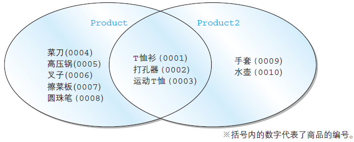
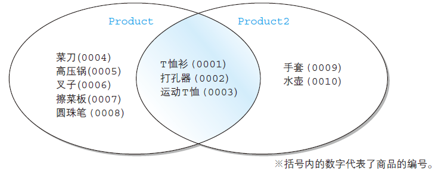
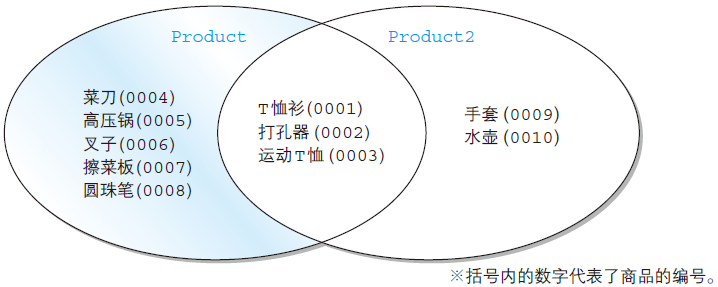
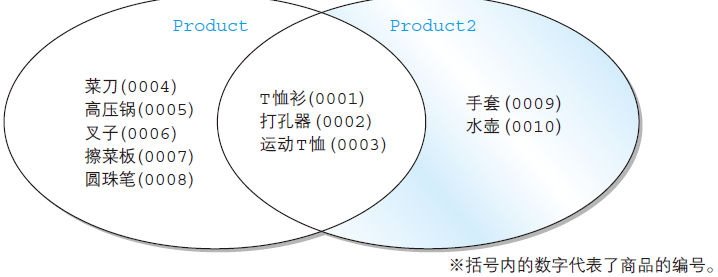
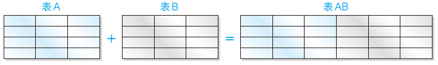

# Task 04：集合运算

**本章学习重点：**
本章将会学习使用 2 张以上的表的SQL语句。通过以行方向（竖）为单位的集合运算符和以列方向（横）为单位的联结，就可以将分散在多张表中的数据组合成为期望的结果。

## 4.1 表的加减法

**本节学习重点：**
（1）集合运算就是对满足同一规则的记录进行的加减等四则运算。
（2）使用UNION（并集）、INTERSECT（交集）、EXCEPT（差集）等集合运算符来进行集合运算。
（3）集合运算符可以去除重复行。
（4）如果希望集合运算符保留重复行，就需要使用ALL选项。

- 什么是集合运算
  一般来说，表、视图和查询的执行结果都是记录的集合。所谓集合运算，就是对满足同一规则的记录进行的加减等四则运算。通过集合运算，可以得到两张表中记录的集合或者公共记录的集合，又或者其中某张表中的记录的集合。像这样用来进行集合运算的运算符称为集合运算符。

- 表的加法——UNION

  举个栗子（使用UNION对表进行加法运算，类似于集合中的并集运算）：

  ```sql
  SELECT product_id, product_name
  FROM product
  UNION
  SELECT product_id, product_name
  FROM product2;
  ```

  

> Note：使用UNION对表进行加法运算，类似于集合中的并集运算。集合运算符会除去重复的记录。

- 集合运算的注意事项：

（1）作为运算对象的记录的列数必须相同

（2）作为运算对象的记录中列的类型必须一致

（3）可以使用任何SELECT语句，但ORDER BY子句只能在最后使用一次

- 包含重复行的集合运算——ALL选项

  只需在UNION后面添加ALL关键即可达到在UNION的结果中保留重复行。

> Note：在集合运算符中使用ALL选项，可以保留重复行。

- 选取表中公共部分——INTERSECT，类似于集合运算中的交集

  使用INTERSECT选取出表中公共部分的图示

与使用AND可以选取出一张表中满足多个条件的公共部分不同，INTERSECT应用于两张表，选取出它们当中的公共记录。

- 记录的减法——EXCEPT，类似于集合运算中的差集

  使用EXCEPT对记录进行减法运算的图示

  EXCEPT 有一点与UNION 和INTERSECT 不同，即在减法运算中减数和被减数的位置不同，所得到的结果也不相同。

  使用EXCEPT对记录进行减法运算的图示（从Product2中除去Product中的记录）

## 4.2 联结（以列为单位进行联结）

**本节学习重点：**
（1）联结（JOIN）就是将其他表中的列添加过来，进行“添加列”的集合运算。UNION是以行（纵向）为单位进行操作，而联结则是以列（横向）为单位进行的。
（2）联结大体上分为内联结和外联结两种。首先请大家牢牢掌握这两种联结的使用方法。
（3）请大家一定要使用标准SQL的语法格式来写联结运算，对于那些过时的或者特定SQL 中的写法，了解一下即可，不建议使用。

- 什么是联结？

  一般来说，UNION和INTERSECT等集合运算，这些集合运算的特征就是以行方向为单位进行操作。通俗地说，就是进行这些集合运算时，会导致记录行数的增减。使用UNION 会增加记录行数，而使用INTERSECT 或者EXCEPT 会减少记录行数。

  **作为集合运算对象的表的前提就是列数要一致。因此，运算结果不会导致列的增减。**

  联结（JOIN）运算，就是将其他表中的列添加过来，进行“添加列”的运算！该操作通常用于无法从一张表中获取期望数据（列）的情况。

  

  SQL的联结包括内联结和外联结两种类型，下面将对这两种联结方式进行重点讲解！

- 内联结——INNER JOIN

  内联结的语法格式：

  ```sql
  -- 内联结：其中 INNER 关键词表示使用了内连结
  FROM <tb_1> INNER JOIN <tb_2> ON <condition(s)>
  ```

（1）内联结要点1 ——FROM子句

（2）内联结要点2 —— ON子句

> Note：进行内联结时必须使用ON子句，并且要书写在FROM和WHERE之间。

（3）内联结要点3 ——SELECT子句

> Note：使用联结时SELECT子句中的列需要按照“<表的别名>.<列名>”的格式进行书写。

（4）内联结和WHERE子句结合使用

- 外联结——OUTER JOIN

（1）外联结要点1 ——选取出单张表中全部的信息

（2）外联结要点2 ——每张表都是主表吗？

指定主表的关键字是LEFT 和RIGHT。使用LEFT 时FROM 子句中写在左侧的表是主表，使用RIGHT时右侧的表是主表。

> Note：外联结中使用LEFT、RIGHT来指定主表。使用二者所得到的结果完全相同。

- 3张以上的表的联结

- 交叉联结——CROSS JOIN

  进行交叉联结时无法使用内联结和外联结中所使用的ON 子句，这是因为交叉联结是对两张表中的全部记录进行交叉组合，因此结果中的记录数通常是两张表中行数的乘积。

  内联结是交叉联结的一部分，“内”也可以理解为“包含在交叉联结结果中的部分”。相反，外联结的“外”可以理解为“交叉联结结果之外的部分”。

- 联结的特定语法和过时语法

**学习小结：**
SQL中比较常见的4个集合运算符。

- UNION（并集）
- EXCEPT（差集）
- INTERSECT（交集）
- CROSS JOIN（笛卡儿积）

## 4.3 学习理解

1. 请说出下述SELECT 语句的结果。

```sql
-- 使用本章中的Product表
SELECT *
FROM Product
UNION
SELECT *
FROM Product
INTERSECT
SELECT *
FROM Product
ORDER BY product_id;
```

由于UNION 或者INTERSECT 未使用ALL，会排除掉重复的记录，因此对同一张表来说，无论执行多少次操作，原表也不会发生改变。

2. 请使用字符串“不确定”替换其中的NULL。期望结果如下所示。

```sql
--- 执行结果：
shop_id | shop_name | product_id | product_name | sale_price
---------+----------+----------+-----------+-----------
000A | 东京 | 0002 | 打孔器 | 500
000A | 东京 | 0003 | 运动T恤 | 4000
000A | 东京 | 0001 | T恤衫 | 1000
000B | 名古屋 | 0006 | 叉子 | 500
000B | 名古屋 | 0002 | 打孔器 | 500
000B | 名古屋 | 0003 | 运动T恤 | 4000
000B | 名古屋 | 0004 | 菜刀 | 3000
000B | 名古屋 | 0007 | 擦菜板 | 880
000C | 大阪 | 0006 | 叉子 | 500
000C | 大阪 | 0007 | 擦菜板 | 880
000C | 大阪 | 0003 | 运动T恤 | 4000
000C | 大阪 | 0004 | 菜刀 | 3000
000D | 福冈 | 0001 | T恤衫 | 1000
不确定 | 不确定 | 0005 | 高压锅 | 6800
不确定 | 不确定 | 0008 | 圆珠笔 | 100
```

```sql
SELECT COALESCE(SP.shop_id, '不确定') AS shop_id,
COALESCE(SP.shop_name, '不确定') AS shop_name,
P.product_id,
P.product_name,
P.sale_price
FROM ShopProduct SP RIGHT OUTER JOIN Product P
ON SP.product_id = P.product_id
ORDER BY shop_id;
```

