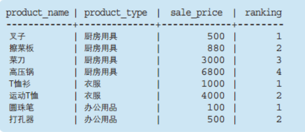
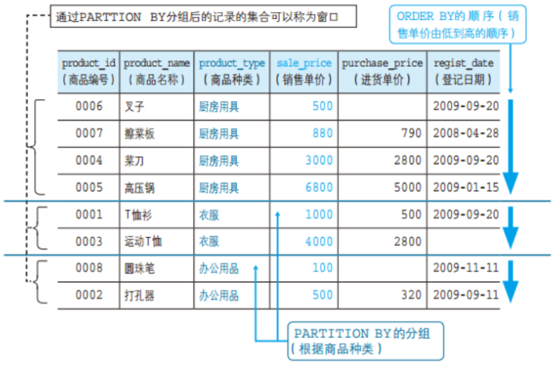
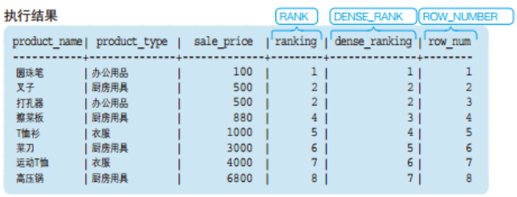
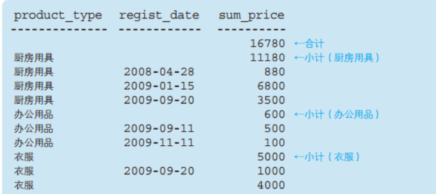

# Task 05：SQL高级处理

## 5.1 窗口函数

- 什么是窗口函数

OLAP 是OnLine Analytical Processing 的简称，意思是对数据库数据进行实时分析处理。而窗口函数就是为了实现OLAP 而添加的标准SQL 功能。

- 窗口函数的语法

窗口函数的语法的语法格式：

```sql
<窗口函数> OVER ([PARTITION BY <列名>]
                     ORDER BY <排序用列名>)  
```

Show me the code:

```sql
SELECT product_name
       ,product_type
       ,sale_price
       ,RANK() OVER (PARTITION BY product_type
                         ORDER BY sale_price) AS ranking
  FROM product  
```

执行结果：



其中，PARTITION BY 能够设定窗口对象范围。本例中，为了按照商品种类进行排序，我们指定了product_type。即一个商品种类就是一个小的"窗口"。ORDER BY 能够指定按照哪一列、何种顺序进行排序。为了按照销售单价的升序进行排列，我们指定了sale_price。此外，窗口函数中的ORDER BY与SELECT语句末尾的ORDER BY一样，可以通过关键字ASC/DESC来指定升序/降序。省略该关键字时会默认按照ASC，也就是升序进行排序。本例中就省略了上述关键字 。



> Note：理解`partition by`和`order by`的功能：
>
> （1）**PARTITON BY**是用来分组，即选择要看哪个窗口，类似于GROUP BY 子句的分组功能，但是PARTITION BY 子句并不具备GROUP BY 子句的汇总功能，并不会改变原始表中记录的行数。
>
> （2）**ORDER BY**是用来排序，即决定窗口内，是按那种规则(字段)来排序的。

**能够作为窗口函数使用的函数**
（1）能够作为窗口函数的聚合函数（SUM、AVG、COUNT、MAX、MIN）
（2）RANK、DENSE_RANK、ROW_NUMBER 等专用窗口函数

- 语法的基本使用方法——使用RANK函数


> Note：窗口函数兼具分组和排序两种功能。通过PARTITION BY分组后的记录集合称为“窗口”。

- 无需指定PARTITION BY

- 专用窗口函数的种类

**RANK函数**

- 计算排序时，如果存在相同位次的记录，则会跳过之后的位次。

**DENSE_RANK函数**

- 同样是计算排序，即使存在相同位次的记录，也不会跳过之后的位次。

**ROW_NUMBER函数**

由于专用窗口函数无需参数，因此通常括号中都是空的。

- 窗口函数的适用范围

原则上窗口函数只能在SELECT子句中使用。

- 作为窗口函数使用的聚合函数

**指定框架（汇总范围）**

**将当前记录的前后行作为汇总对象**

- 计算移动平均
- 两个ORDER BY

Show me the code:

```sql
SELECT  product_name
       ,product_type
       ,sale_price
       ,RANK() OVER (ORDER BY sale_price) AS ranking
       ,DENSE_RANK() OVER (ORDER BY sale_price) AS dense_ranking
       ,ROW_NUMBER() OVER (ORDER BY sale_price) AS row_num
  FROM product  
```

执行结果：



> Note：将聚合函数作为窗口函数使用时，会以当前记录为基准来决定汇总对象的记录。

## 5.2 GROUPING运算符

- 同时计算出合计值

- ROLLUP——同时得出合计和小计

GROUPING 运算符包含以下3 种。

- ROLLUP
- CUBE
- GROUPING SETS

**ROLLUP的使用方法：**

常规的GROUP BY 只能得到每个分类的小计，有时候还需要计算分类的合计，可以用 ROLLUP关键字。

```sql
SELECT  product_type
       ,regist_date
       ,SUM(sale_price) AS sum_price
  FROM product
 GROUP BY product_type, regist_date WITH ROLLUP  
```

执行结果为：



> Note：ROLLUP可以同时得出合计和小计，是非常方便的工具。

- GROUPING函数——让NULL更加容易分辨

- CUBE——用数据来搭积木

> 可以把CUBE理解为将使用聚合键进行切割的模块堆积成一个立方体。

- GROUPING SETS——取得期望的积木

## 5.3 学习理解

1. 请说出针对本章中使用的Product（商品）表执行如下SELECT 语句所能得到的结果。

   ```sql
   SELECT  product_id
          ,product_name
          ,sale_price
          ,MAX(sale_price) OVER (ORDER BY product_id) AS Current_max_price
     FROM Product
   ```

2. 继续使用Product表，计算出按照登记日期（regist_date）升序进行排列的各日期的销售单价（sale_price）的总额。排序是需要将登记日期为NULL 的“运动T 恤”记录排在第1 位（也就是将其看作比其他日期都早）。

